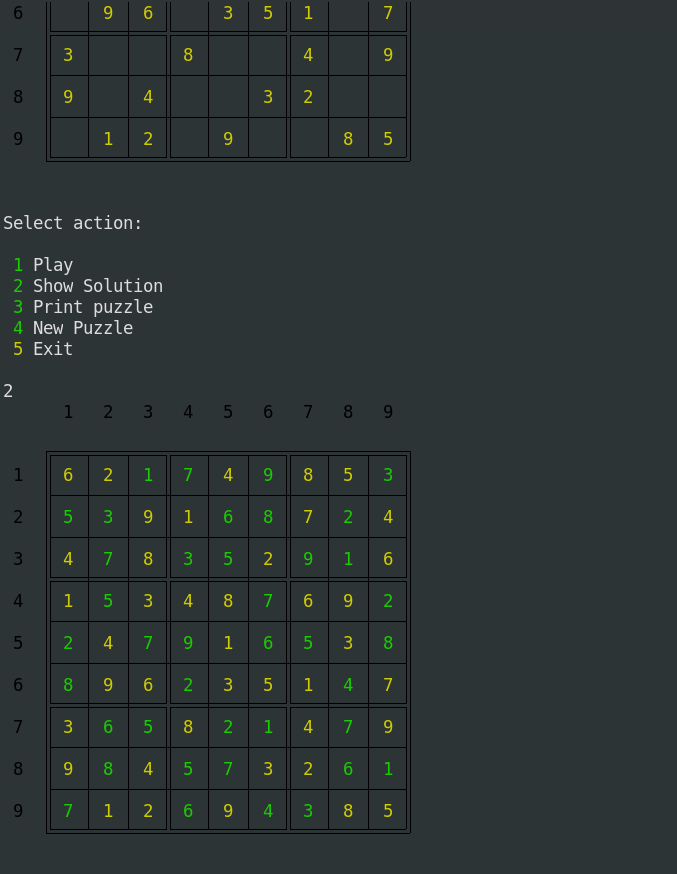
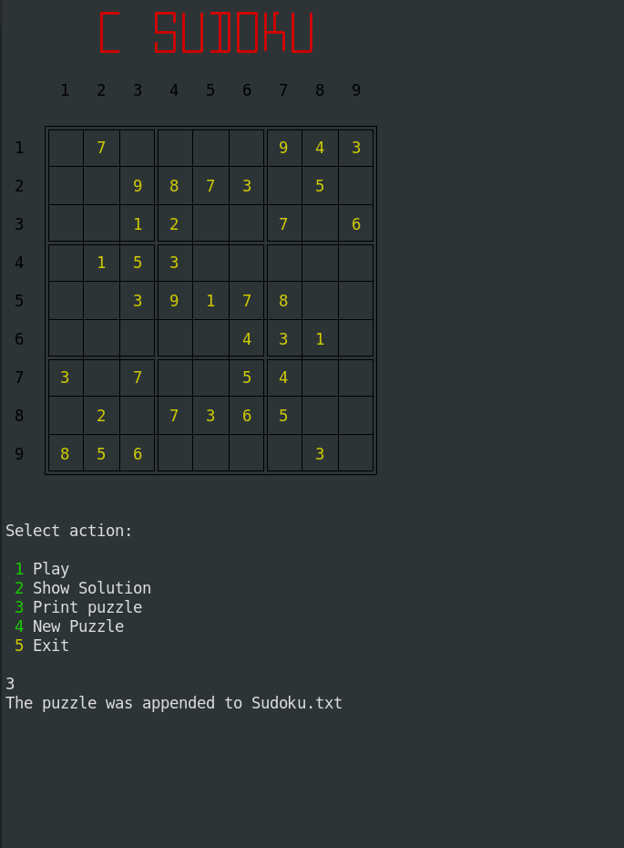
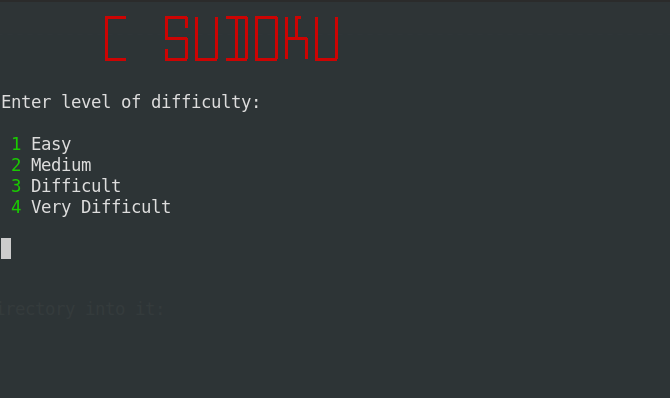
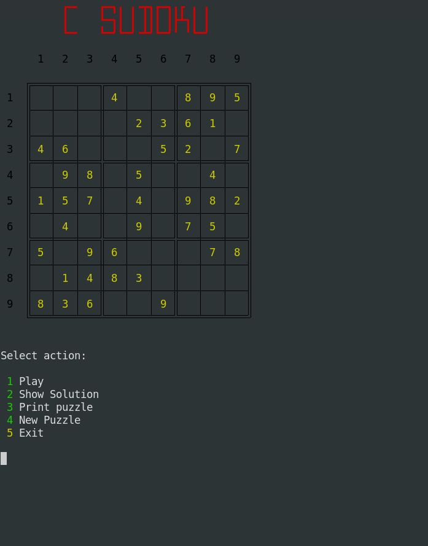
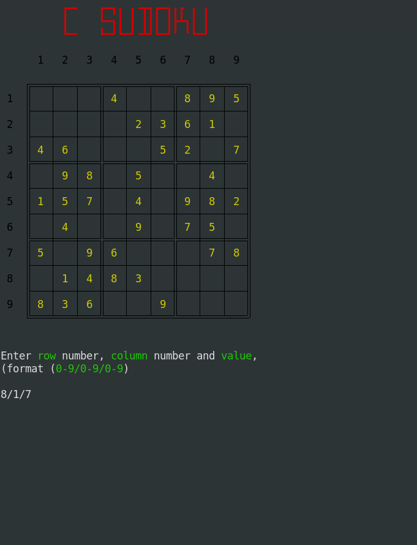
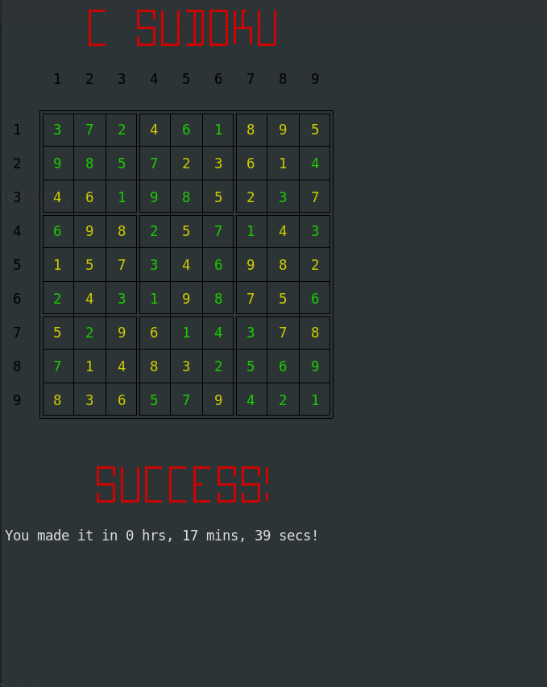
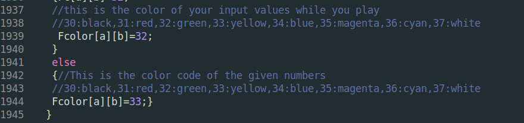
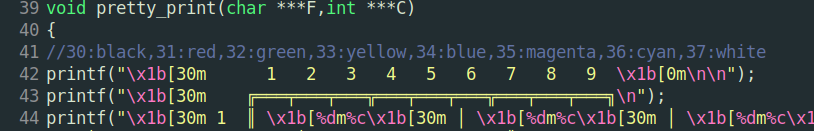
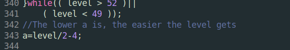

# C-Sudoku

C-Sudoku is a program written in C programming language.

It was created in continuation of another fun project  the

 [**Sudoku Solver** ](https://gitlab.com/christosangel/sudoku-solver)

**C-Sudoku** generates sudoku riddles, in four levels of difficulty.

You can solve these riddles in  CLI(command-line interface).

From a simple menu, the user can :

  * Play the game,

  * See the solution of the game,

  * Save the riddle in a simple txt file so that it can be printed,

  * Generate a new riddle.

### INSTRUCTIONS

Using the terminal interface, after you clone the folder and change directory into it:

		git clone https://gitlab.com/christosangel/c-sudoku.git

		cd c-sudoku

you will need to compile c-sudoku.c:

		gcc c-sudoku.c -Wall -o c-sudoku

After that, all you need to need is run the executable:

		./c-sudoku

You will have to wait a couple of seconds for the machine to calculate a

new riddle (the speed depends on the processing capability of your hardware).

You will be prompted to give your prefered level of difficulty:

After that you can select between playing or saving the riddle, generating

 a new one, or exiting:

If you select **Play**, you can enter the data (row number, column number
 and value, in a specific format 0-9/0-9/0-9, e.g. 3/5/7:

When you solve the riddle, you will be given your time:

### CuSTOMIZING

* The colors of the sudoku matrix are customisable:

* The difficulty level is also quite arbitrary, and depends on how many numbers are missing.

    The difficulty levels can also be altered:

**ENJOY!**
